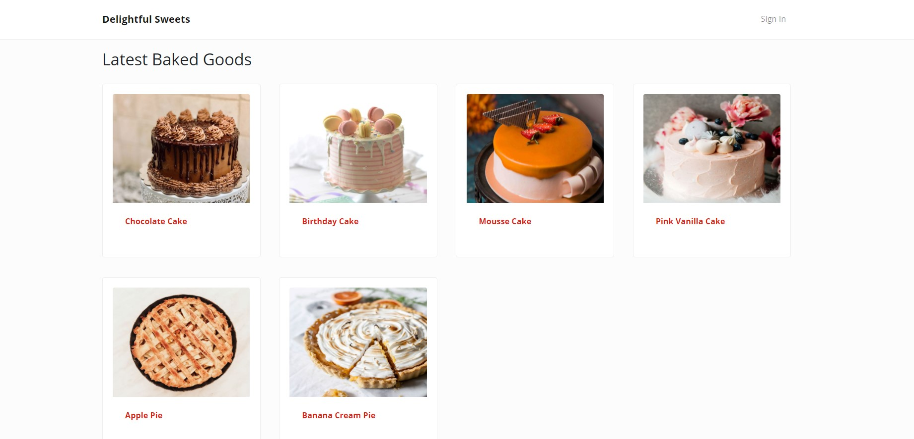

# Delightful Sweets - Cake Shop Web Application

## Description
This is a web application that allow users to create an account with a fictional bakery, Delightful Sweets, and order baked goods such as cake and pies to be made
and deliver to.

## About the project
This personal project was started for me to learn and practice making a full-stack web application using the following technologies:
- Node.js
- Express
- React + Redux
- MongoDB

## Current progress

### Application can do the following:
- Create a new accoount
- Admin user can edit and delete users

### The following features are being work on at the moment:
- Product details screen to allow Admin user to list all products and create, edit and delete a product
- User make an order and use PayPal to process payment
- Generate a list of order to be bake
